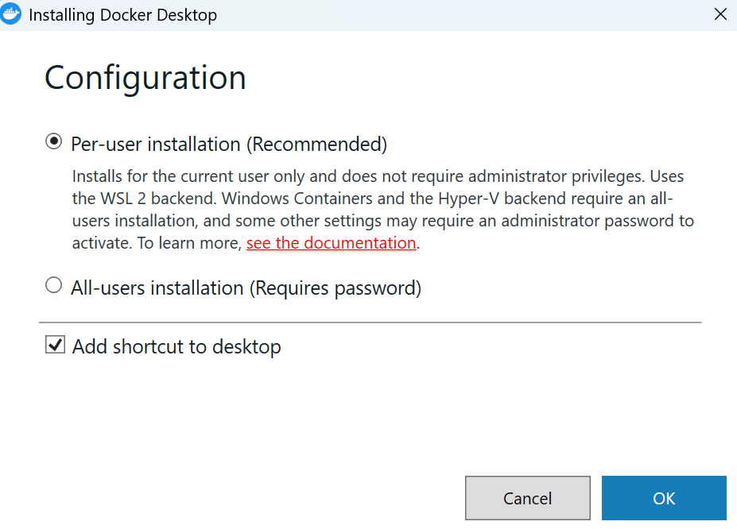

# What is a docker?

Without Docker, the same code may encounter different problems on different computers. For example, the version of Python you use may be different from someone else's, some required libraries may not be installed, or there may be differences between Windows, macOS, and Linux. As a result, code that runs normally on one computer may stop working when moved to another.

Docker runs your program inside a **container**. A container is an isolated environment created from a Docker image that contains the operating system environment, software, programming languages, libraries, and other dependencies required by a program. When everyone creates a container from the same image, they are essentially running the program with the same set of software and dependencies. 

As you start using Docker in practice, you will gradually become familiar with some basic operations, such as starting the environment, entering a container, and running code inside it.

# How to install a docker?

### 1. Install Docker Desktop

First, install **Docker Desktop** on your computer.

* Windows users: [install Docker Desktop for Windows.](https://docs.docker.com/desktop/setup/install/windows-install/)
* macOS users: [install Docker Desktop for Mac](https://docs.docker.com/desktop/setup/install/mac-install/).

After the installation is complete, **open Docker Desktop**.

**Docker Desktop needs to be running when you use Docker commands.**

---

### 2. Check Whether Docker Is Installed Correctly

Open a Terminal, PowerShell, or Command Prompt and enter:

```bash
docker --version
```

If Docker has been installed correctly, you should see the installed Docker version.

Then enter:

```bash
docker compose version
```

If this command also displays version information, Docker Compose is ready to use.

---

### 3. Unzip the Project Files

Unzip the project file provided for this course:

```text
engg1330_project_docker_v03.zip
```

After extracting it, you should see a directory structure similar to the following:

```text
project_docker/
├── dockerfile
├── compose.yaml
├── requirements.txt
├── entrypoint.sh
└── project/
    └── tic_tac_toe.py
```

Some important files are:

* `dockerfile`: defines how the Docker environment should be created.
* `requirements.txt`: lists the Python libraries required by the project.
* `compose.yaml`: defines how the Docker container should be created and run.
* `project/`: contains the Python code that we will edit and run.

---

### 4. Open the Project Directory in the Terminal

Open a terminal and navigate to the directory that contains `dockerfile` and `compose.yaml`.

For example, on Windows, if your project is located at:

```text
D:\ENGG1330\project_docker
```

you can enter:

```bash
cd D:\ENGG1330\project_docker
```

Before running the following commands, make sure that you are in the correct directory and can see files such as:

```text
dockerfile
compose.yaml
requirements.txt
project/
```

---

### 5. Build the Docker Image

The first time you use this project, you need to build the Docker image.

Run:

```bash
docker compose build
```

Docker will read the `dockerfile` and automatically prepare the environment required by the program.

For example, the Docker environment for this project includes:

* Python 3.13
* required Linux tools
* the Python libraries listed in `requirements.txt`

Therefore, you do not need to install all these libraries manually on your own computer.

The process can be understood as:

```text
Dockerfile
    ↓
Docker reads the instructions
    ↓
Docker Image
```

A Docker image can be thought of as a prepared template for the programming environment.

The first build may take some time because Docker needs to download and install the required components.

---

### 6. Run the Program Inside a Container

After the image has been built successfully, run:

```bash
docker compose run --rm game
```

Docker will create a **container** from the image and run the program inside that container.

The overall process can be understood as:

```text
Dockerfile
    ↓
Image
    ↓
Container
    ↓
Run your code
```

In this project, the container will run:

```text
tic_tac_toe.py
```

---

### 7. Edit Your Code

The Python file that you need to edit is located at:

```text
project/tic_tac_toe.py
```

You can edit this file using VS Code or another code editor.

The `project` folder on your computer is connected to the working directory inside the Docker container:

```text
Your computer:
project/

        ↓

Docker container:
/workspace
```

This means that when you modify the Python code on your computer, the updated file will also be available inside the container.

Therefore, you normally **do not need to rebuild the Docker image every time you change your Python code**.

After editing your code, simply run:

```bash
docker compose run --rm game
```

again to test the updated program.

---

### Summary

The complete setup process is:

```text
1. Install Docker Desktop

2. Start Docker Desktop

3. Unzip the project files

4. Open the project_docker directory in the terminal

5. Build the Docker image:

   docker compose build

6. Run the program inside the container:

   docker compose run --rm game

7. Edit project/tic_tac_toe.py and run the command again to test your code
```

The most important relationship to remember is:

```text
Dockerfile → Image → Container → Run Code
```

The `Dockerfile` defines the environment. Docker uses it to build an **image**, and the image is then used to create a **container**. Your program is finally executed inside this container, where the required programming environment has already been prepared.
