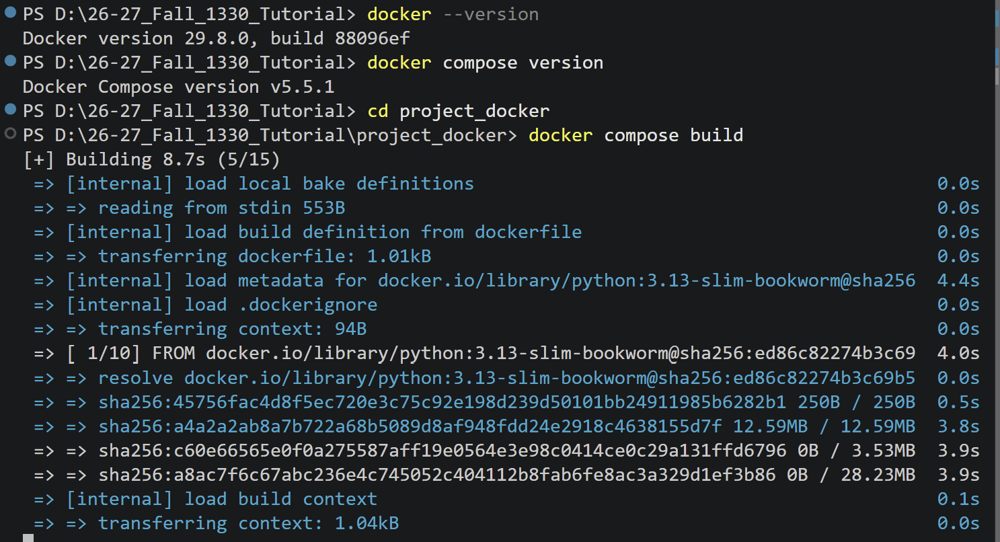
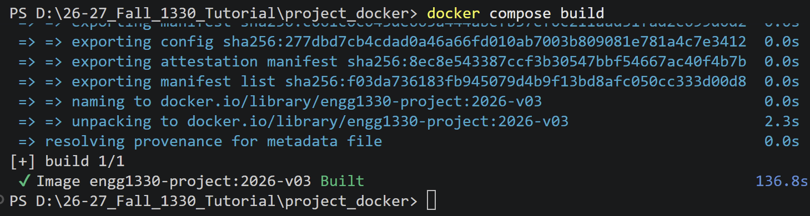
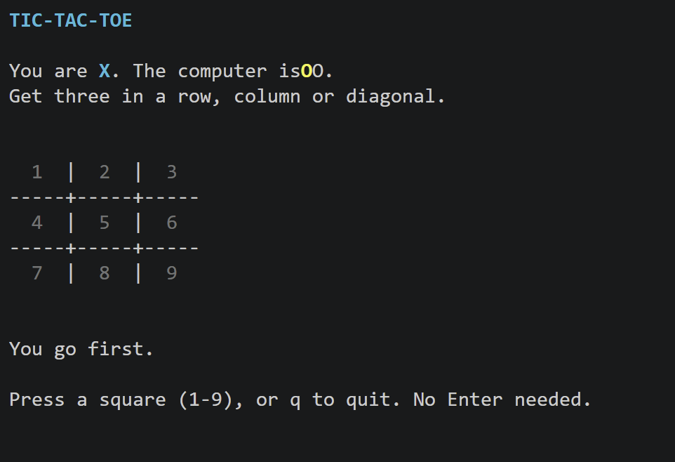

# What is a docker?

Without Docker, the same code may encounter different problems on different computers. For example, the version of Python you use may be different from someone else's, some required libraries may not be installed, or there may be differences between Windows, macOS, and Linux. As a result, code that runs normally on one computer may stop working when moved to another.

Docker runs your program inside a **container**. A container is an isolated environment created from a Docker image that contains the operating system environment, software, programming languages, libraries, and other dependencies required by a program. When everyone creates a container from the same image, they are essentially running the program with the same set of software and dependencies. 

As you start using Docker in practice, you will gradually become familiar with some basic operations, such as starting the environment, entering a container, and running code inside it.

# How to install a docker?

### 1. Install Docker Desktop

First, install **Docker Desktop** on your computer.

* Windows users: [install Docker Desktop for Windows.](https://docs.docker.com/desktop/setup/install/windows-install/)
* macOS users: [install Docker Desktop for Mac](https://docs.docker.com/desktop/setup/install/mac-install/).

After the installation is complete, **open Docker Desktop**.

**Docker Desktop needs to be running when you use Docker commands.**

**Skip Signing i**

### 2. Check Whether Docker Is Installed Correctly

Open a Terminal, PowerShell, or Command Prompt and enter:

```bash
docker --version
```

If Docker has been installed correctly, you should see the installed Docker version.

Then enter:

```bash
docker compose version
```

If this command also displays version information, Docker Compose is ready to use.

---

### 3. Unzip the Project Files

Unzip the project file provided for this course:

```text
engg1330_project_docker_v03.zip
```

After extracting it, you should see a directory structure similar to the following:

```text
project_docker/
├── dockerfile
├── compose.yaml
├── requirements.txt
├── entrypoint.sh
└── project/
    └── tic_tac_toe.py
```

Some important files are:

* `dockerfile`: defines how the Docker environment should be created.
* `requirements.txt`: lists the Python libraries required by the project.
* `compose.yaml`: defines how the Docker container should be created and run.
* `project/`: contains the Python code that we will edit and run.

---

### 4. Open the Project Directory in the Terminal

Open a terminal and navigate to the directory that contains `dockerfile` and `compose.yaml`.

For example, on Windows, if your project is located at:

```text
D:\ENGG1330\project_docker
```

you can enter:

```bash
cd D:\ENGG1330\project_docker
```

Before running the following commands, make sure that you are in the correct directory and can see files such as:

```text
dockerfile
compose.yaml
requirements.txt
project/
```

---

### 5. Build the Docker Image

The first time you use this project, you need to build the Docker image.

Run:

```bash
docker compose build
```

Docker will read the `dockerfile` and automatically prepare the environment required by the program.



---

### 6. Run the Program Inside a Container

After the image has been built successfully, run:

```bash
docker compose run --rm game
```

In this project, the container will run:

```text
tic_tac_toe.py
```

---

### 7. Edit Your Code

The Python file that you need to edit is located at:

```text
project/tic_tac_toe.py
```

You can edit this file using VS Code or another code editor.

The `project` folder on your computer is connected to the working directory inside the Docker container:

```text
Your computer:
project/

        ↓

Docker container:
/workspace
```

This means that when you modify the Python code on your computer, the updated file will also be available inside the container.

Therefore, you normally **do not need to rebuild the Docker image every time you change your Python code**.

After editing your code, simply run:

```bash
docker compose run --rm game
```

again to test the updated program.

---

# Play, Inspect, Change

Now that the Docker environment is running successfully, we will explore the provided Tic-Tac-Toe program.

The aim of this activity is **not** to understand the entire program. Some parts of the code use functions and libraries that we have not studied yet.

Instead, focus on three things:

```text
Play → Inspect → Change
```

---

## 1. Play the Game

Start the game with:

```bash
docker compose run --rm game
```

You are `X`, and the computer is `O`.

Use the number keys `1`–`9` to select a square.

Try playing one complete game first.

### Try some unusual input

While playing, deliberately try something invalid.

For example:

* press a letter instead of a number;
* press `0`;
* select a square that is already occupied.

Observe how the program responds.

Ask yourself:

> Does invalid input crash the program?

> How does the program prevent an invalid move from changing the board?

You do not need to understand the implementation yet. Simply observe the behaviour.

---

## 2. Try Resizing the Terminal

While the game is running, make the terminal window smaller.

The program requires approximately:

```text
80 × 24
```

characters of terminal space.

If the window becomes too small, the game should pause and ask you to resize the terminal.

Resize the window again and observe what happens.

This is another example of a program responding to conditions in its environment rather than assuming that everything will always be valid.

---

## 3. Quit the Game

Press:

```text
q
```

to quit.

Now open:

```text
project/tic_tac_toe.py
```

in VS Code or another editor.

You do **not** need to understand the entire file.

For now, simply inspect it.

---

# Inspect

## 4. Find the Computer Move Logic

Search for:

```python
def computer_move(board):
```

You should find a function similar to this:

```python
def computer_move(board):
    """Win if possible, block an immediate loss, then choose a free square."""
    choices = available_moves(board)

    if not choices:
        raise ValueError("There are no free squares.")

    for mark in ("O", "X"):
        for move in choices:
            trial = board.copy()
            trial[move] = mark

            if winner(trial) == mark:
                return move

    if 4 in choices:
        return 4

    return random.choice(choices)
```

Do not worry if some of this code is unfamiliar.

At the moment, we only need to understand the overall idea:

```text
computer_move(board)
        ↓
decides which square the computer should choose
```

The rest of the game will call this function whenever the computer needs to make a move.

---

## 5. Find the Available Moves

Now find:

```python
def available_moves(board):
```

It returns the positions on the board that are still empty.

Conceptually:

```text
Board:

X |   | O
---------
  | X |
---------
O |   |

Available squares:
2, 4, 6, 8
```

The exact representation inside the program is slightly different, but the main idea is simple:

> `available_moves(board)` gives us the moves that the computer is actually allowed to make.

---

# Change

## 6. Make One Small Visible Change

Before changing the computer strategy, make one simple visible edit to the program.

For example, find:

```python
"TIC-TAC-TOE"
```

and change it to something easy to recognise, such as:

```python
"ENGG1330 TIC-TAC-TOE"
```

Save the file.

Now run:

```bash
docker compose run --rm game
```

again.

You should immediately see your change.

### Important

Notice what we did **not** run:

```bash
docker compose build
```

We did not rebuild the Docker image.

Why?

The project directory on your computer is connected directly to:

```text
/workspace
```

inside the container.

Therefore:

```text
Edit file on your computer
        ↓
Container sees the updated file
        ↓
Run the program again
```

A normal change to `tic_tac_toe.py` does not require rebuilding the image.

---

# Optional Extension: Random Computer Moves

Now we will change how the computer chooses its move.

The current computer is not completely random.

It tries to:

```text
win
↓
block you
↓
take the centre
↓
choose another available square
```

For this exercise, we want something much simpler:

> Every currently available square should have an equal probability of being selected.

---

## 7. Think Before Coding

Suppose there are four available squares.

What should the probability of choosing each square be?

```text
1 / 4
```

If there are six available squares:

```text
1 / 6
```

In general:

```text
Probability of each move
=
1 / number of available moves
```

Now consider this:

```python
random.choice(...)
```

`random.choice()` chooses one element randomly from a sequence.

So what sequence should we give it?

---

### Would this work?

```python
random.choice(range(9))
```

Think about it before continuing.

This chooses uniformly from **all nine squares**.

But some of those squares may already be occupied.

For example:

```text
X | O |
---------
  | X |
---------
O |   |
```

Choosing randomly from all nine positions could select a square that already contains `X` or `O`.

So the problem is not simply:

> Choose a random square.

The real problem is:

> Choose randomly from the **valid available squares**.

---

## 8. Modify `computer_move`

We already have a function that gives us exactly those valid moves:

```python
available_moves(board)
```

Therefore, the simplest uniformly random strategy is:

```python
return random.choice(available_moves(board))
```

Replace the decision logic inside `computer_move()` with:

```python
def computer_move(board):
    return random.choice(available_moves(board))
```

Save the file.

---

## 9. Test the Modified Program

Run the game again:

```bash
docker compose run --rm game
```

Again, you do **not** need to rebuild the Docker image.

Play several rounds and observe the computer.

It should no longer deliberately:

* block you;
* take the centre;
* try to win immediately.

Instead, every available move has the same probability of being chosen.

---

# Why Does This Work?

Suppose:

```python
available_moves(board)
```

returns:

```python
[1, 3, 5, 7]
```

Then:

```python
random.choice([1, 3, 5, 7])
```

chooses one of those four values.

Each one has probability:

```text
1 / 4
```

If only two moves remain:

```python
[3, 7]
```

then each has probability:

```text
1 / 2
```

This is why choosing from `available_moves(board)` produces a **uniform random choice among valid moves**.

---

# Main Idea

The important part is not the one-line solution:

```python
return random.choice(available_moves(board))
```

Instead, notice how we simplified the problem:

```text
What does the computer need to choose?
        ↓
A legal move
        ↓
Which moves are legal?
        ↓
available_moves(board)
        ↓
Choose one of them uniformly
        ↓
random.choice(...)
```

When solving a programming problem, try to identify exactly what set of values your answer is allowed to come from **before** deciding how to choose one.
